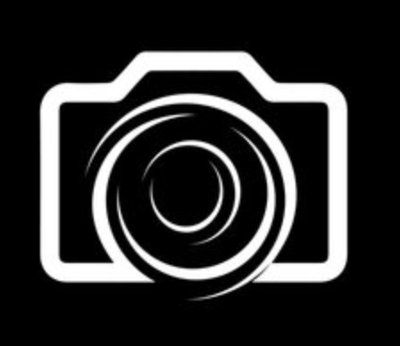
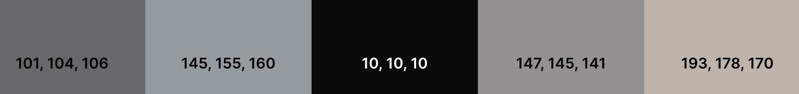

# Capture 

**Developer: Asma Aamir**

[Visit live website](link)

## Table of Contents
- [About](#about)
- [Project Goals](#project-goals)
- [UserStories](#user-stories)
- [Design](#design)
    - [Colours](#colours)
    - [Font](#font)
    - [Wireframe](#wireframes)
- [Features](#features)    
- [Technologies](#tecnolgoes)
    - [Languages](#languages)
    - [Libraries, frameworks and dependencie](#libraries-framework-dependencies)
    - [Tools & Programs](#tools-programs)
- [Front-End](#front-end)
- [Back-End](#back-end)
- [Validation](#validation)
- [Testing](#testing)
    - [Manual](#manual)
- [Bugs](#bugs)
- [Config](#config)
- [Credits](#credits)

## About 

Capture is a platform where user's can share photo's of their adventures, inspiring other people to travel or add the location to their vacation list.
This platform allows users to keep up with other users posts, like other user posts, comment on, and follow them. To upload posts, like, comments, and follow other users, user must be signed in. 
Capture is a platform where user's can share photo's of their adventures, inspiring other people to travel or add the location to their vacation list. To upload posts, like comments, and follow other users, user must be signed in. To keep up with other users posts, the app lets users like, comment on, and follow them. 

## Project Goals 

The goals for the project was to build a platform that would enable users to interact with one another in a number of ways, such as by leaving comments on other user's posts or by following other users to keep up with their posts . While ensuring that the website is easy to navigate. 

## UserStories 

## Design 

### Colours 
I kept the images that would be shared on this website in mind when I designed the colour scheme for this project. I want the post to be the primary focus and nothing else. Hence, I maintained the text in black and grey and the background.

### Font

### Wireframes

## Features 

## Technologies

### Languages 
- HTML
- CSS
- Javascript 
    - React

### Libraries, frameworks and dependencie

### Tools & Programs
- Balsamiq (https://balsamiq.com/) - Used to create the wireframe for the project
- Cloudinary (https://cloudinary.com/) - Used to store store static files  
- Coolors (https://coolors.co/) - Used to design the project's colour palette 
- Favicon.io (https://favicon.io/favicon-converter/) - Used to create the website favicon.
- Font Awesome (https://fontawesome.com/) - Used to get all the Icon used on this website
- Google Font (https://fonts.google.com/) - Used to get the font style
- Github (https://github.com/) - Used to create a repository where the project's files are stored
- CodeAnyWhere (https://codeanywhere.com/solutions/collaborate) - Used for the development for thsi project.
- Am I Responsive (https://ui.dev/amiresponsive ) - Used to create a sample to show how it would look on different device. 
- WC3 Valdator (https://validator.w3.org/) - Used to Validate the HTML code
- Jigsaw W3 Validator (https://jigsaw.w3.org/css-validator/) - Used to Validate the CSS code
- Lighthouse (https://developer.chrome.com/docs/lighthouse/overview/) - Used to check perfomance, accessibilty and best practice. 
- Wave (https://wave.webaim.org/extension/) - Used to check website accessibilty

## Front-End

## Back-End

I created the front-end API for this project using the Django REST Framework. You can find the DRF Back-End repository [here](https://github.com/AsmaaAamir/Capture_API_DRF). 

## Validation

## Testing

### Manual

## Bugs

## Config

## Credits

